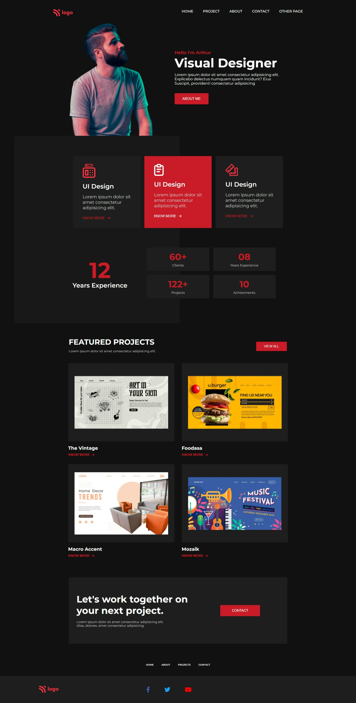
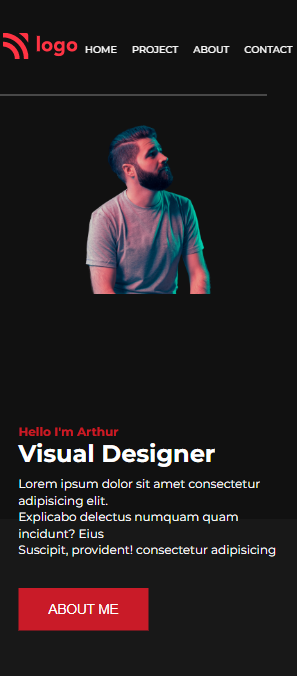
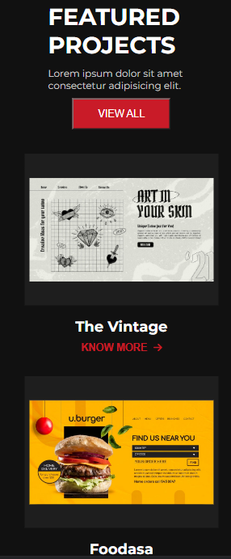
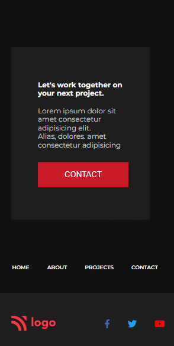

# Project-15

[Live link Project-15](https://vinod-kumar-project-15.netlify.app/)

>  I learned from this project
    -   More about navbars navbar properties, flex box properties and positions, icons and positions.
---

## Duration of complete this project

-   Approx 7 hour taken to complete this project and I am working as fulltime employee in non iT and I am working between night 7:30 to 11:00 PM.
-   Now I am fully confidenced to build any websites.
-   Mobile version updated.

## **The website same as below image**

